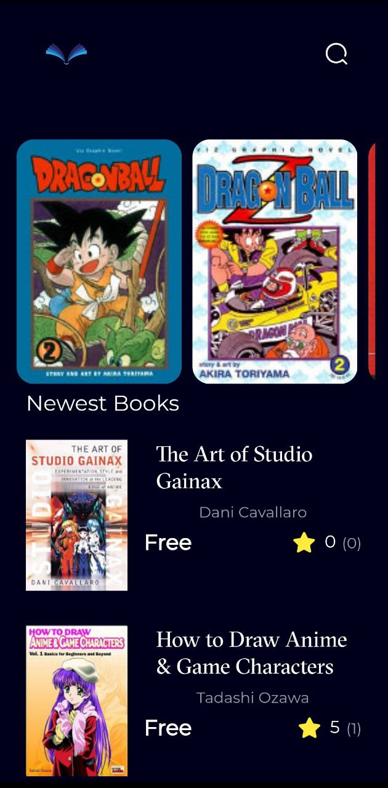

# Book App

Welcome to the Book App repository! This Application use google API to review and download free anime books and user be allowed to review and download these books.

## Features

- Used MVVM design pattern and Cubit state management to create this Application.
- User can review the books  before downloading them.
- User-Friendly Mobile App

## How To Use The App

1. Clone this repository to your local machine.
2. Open the project in your preferred Flutter development environment.
3. Run the app on an emulator or a physical device.
4. Use on-screen controls to move and rotate tetrominoes.
5. Aim to clear as many lines as possible to score points.

## Contributing

Contributions to improve the game are welcome! If you'd like to contribute, please follow these steps:

1. Fork the repository.
2. Create a new branch for your feature or bug fix.
3. Implement your changes and improvements.
4. Test thoroughly and ensure existing functionality is not affected.
5. Open a pull request detailing your changes.

## License

This project is licensed under the [MIT License](LICENSE).

